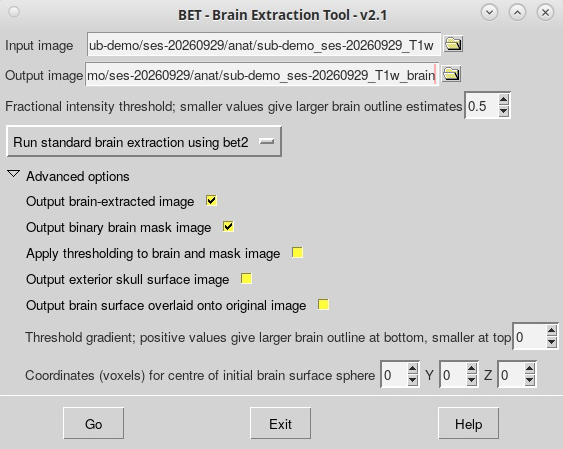
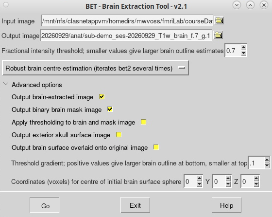

**By the end of this practical you should be able to complete preprocessing on your data with the following steps:**

- [ ] Use FSL's [BET](https://fsl.fmrib.ox.ac.uk/fsl/fslwiki/BET/UserGuide) tool to remove the skull from a T1 image
- [ ] Use FSLeyes to check the output of `BET`

**Access FastX** through the remote login:

https://fastx.divms.uiowa.edu:3443/

**In the terminal, move to the folder where our downloaded data is:**

- At the terminal prompt, type `cd fmriLab`
- Type `ls` and you should see the data you downloaded as a folder named `courseData_FA26`

**Using FSL's Brain Extraction Tool (BET) to skull-strip:**

- At the prompt, type `fsl`
- Click the **BET brain extraction** button on the FSL menu
- We will use `BET` to do a brain extraction on the our demo participant
- Set up `BET` with default options:
    - Click the yellow folder to select your T1 image with skull as your **Input Image**
    - FSL will automatically fill in the **Output Image** with the same filename as your T1 and `_brain` at the end
    - Expand **Advanced Options**
        - Select **Output binary brain mask image**
    - Select **Go** to run `BET`
    - In the terminal you will see text appear, that text shows how the GUI selections are translated into bash syntax for the fsl software to run the command 
    - `Finished` will appear in the terminal when BET is done

Example of what your menu options should look like for these default settings: 

**Checking BET:**

- Use the GUI menu to open your T1 with skull and brain mask in FSLeyes
- Move the mask image to be the top layer in your `Overlay list`
- Change the color of the mask to yellow by selecting the `Red-Yellow` color scheme
- Use the **Opacity** slider to make the mask semi-transparent so you can see the brain image in the background
- Use this checklist:
    - [ ] **Top of the brain:** Does the mask cover the brain without missing sections OR spilling into the eyes or skull?
    - [ ] **Bottom of the brain:** Does the mask "hug" the brainstem without spilling into the throat?

**Modifying BET settings:**

- Open or return to the BET GUI
- An advanced option that often helps: use the dropdown menu to select **Robust brain centre estimation**
- If your mask was too small or too large at the top of the brain, change the **Fractional intensity threshold**
- If your mask was too small or too large at either the top or bottom of the brain, change the **Threshold gradient**

Example of what your menu options look like with modified settings for Robust BET and modified f and g setting, naming the file output to document f and g settings:

- Work in small groups to change your `-f` and `-g` options to produce different outputs, explore a range of options to learn! You won't break anything, promise.
- Take turns showing each other what happens when these parameters are modified and decide what you think would be a sweet spot of good settings for this image, and why.
- Use your collective knowledge to setting on a good combination of -f and -g parameters to arrive at a good BET result. 

**Lab 2 assignment**

Take two screenshots that demonstrate poor and good BET output

    1. Take a screenshot of your poor BET on the T1, with a yellow, reduced opacity mask. Show a view in fsleyes that demonstrates poor brain extraction. 
    2. Save your screenshot as `poor_bet.png`
    3. Take a screenshot of your good BET on the T1, with a yellow, reduced opacity mask. Show the SAME view as shown for your poor result. Use the cursor settings and/or toggling on/off layers to help you show the same slices for both masks.
    4. Save your screenshot as `good_bet.png`